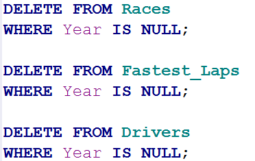

# F1-SQL-Project
Querying a small F1 historical dataset, with three tables, to gain insight into historical trends and all-time leaders.

## Overview + Repo Structure
My aim coming into this project, while ostensibly to practice SQL, was to look into historical F1 data and see how older drivers stacked up to current drivers. SQL proved to be a perfect tool for this - with three tables, one of my queries utilized a join function to cross-examine data. Another utilized a CTE to simplify a larger query, and yet another used a window function to rank the longest races of each driver.

From this I was able to find out about many interesting facts, including Mercedes having more than half of Ferrari's points with only one tenth of the driver count, or that George Russell has the fastest lap of anyone in the 21st century.

The folders "Query Results" and "Screenshots" show the list of images that I provide in the analysis below. "Raw_Data" contains the db and sqbpro files that I performed my analysis on.

Enjoy!

## Data Cleaning

This was the only cleaning step I required; the data was already cleaned with the exception of every other line being blank for some reason.

## Query 1

## Query 2

## Query 3

## Query 4

## Query 5

## Query 6

## Query 7

